> ## 推荐 PC 端打开            &#x20;
>
> #### **手机端浏览体验没PC端体验效果好**
>
> ### 点击蓝字立即跳转：    [🧭课程学习](https://v11enp9ok1h.feishu.cn/wiki/M1MSwcFSwiYcR0kmnt0c4M3tngd#VVFPdC1Z2oOGG5x96Jic30psnje)         [知识库预览](https://v11enp9ok1h.feishu.cn/wiki/KiIvwdFOciiqqNkwKzTcmn88ndL#Uc4XdGXLdoCWMvxxAzZcweM5nhf)       [ 技术指导](https://v11enp9ok1h.feishu.cn/wiki/KiIvwdFOciiqqNkwKzTcmn88ndL#Uc4XdGXLdoCWMvxxAzZcweM5nhf)

## 美团智能客服核心技术与实践

> 在用户服务的全旅程中，美团平台/搜索与**`NLP`**部提供了**问题推荐**、**问题理解**、**对话管理**、**答案供给**、**话术推荐**和**会话摘要**等六大**智能客服核心能力**，以期达到低成本、高效率、高质量地与用户进行沟通的目的。本文主要介绍了美团智能客服核心技术以及在美团的实践。

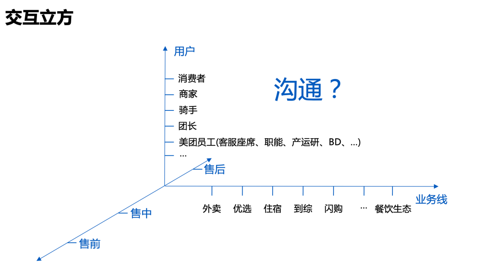

### 面对不同场景的智能客服落地

> 首先，我们看看日常生活中几种最为常见的客服场景。

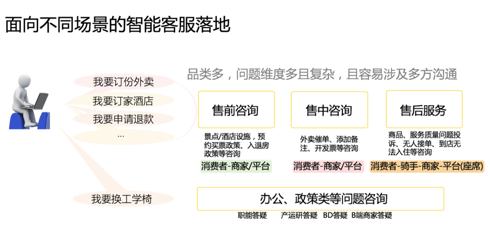

* **售前场景：**比如消费者在平台选择入住酒店，对房型价格、酒店设施、入退房政策等，下单前都有很强的信息咨询诉求。

* **售中场景：**比如外卖催单还没到，添加备注不要辣、加开发票等咨询等等，售前和售中场景主要发生在消费者和商家或平台之间。

* **售后场景：**比如外卖场景投诉菜品少送、骑手送餐超时、要求退款等，酒店场景投诉酒店到店无法入住等，售后往往涉及到客服座席、消费者、骑手和商家，需要多方协同解决。

* **办公场景：**比如IT、人力资源、财务、法务等咨询，产运研对提供的接口产品的咨询答疑，产品对销售顾问的答疑，以及销售顾问对商家的答疑等等。

### 面对不同人群的智能客服落地

> 沟通是人类的一项基本需求，在绝大多数场景下，我们对沟通的追求都是以**低成本**、**高效率**和**高质量**为目标，而对话机器人也需要**同时满足这三点要求**。目前我们按照服务的群体进行划分，**智能客服**落地场景大体可以分为**以下四类：**

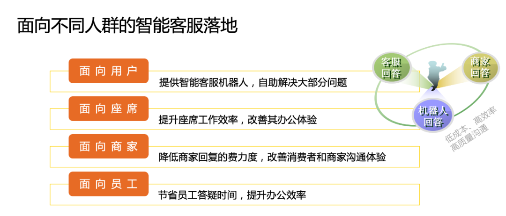

* **面向用户：**提供智能客服机器人，来帮助他们自助解决大部分的问题。

* **面向座席：**用话术推荐或者会话摘要等能力来提升人工座席的工作效率。

* **面向商家：**打造商家助手来降低商家回复的费力度，改善消费者和商家的沟通体验。

* **面向员工：**通过对话机器人，可以自助给员工进行答疑，从而提升办公效率。

### 智能客服是什么

> 要回答智能客服是什么，可以先看看客服是什么。客服是在用户服务体验不完美的时候，**来帮助体验顺畅进行下去的一种解决办法，是问题发生后的一种兜底方案。**而智能客服能让大部分简单的问题得以快速自助解决，让复杂问题有机会被人工高效解决。

> * 上图展示的是用户服务旅程。首先，用户会通过**在线打字**或者**拨打热线电话**的方式进线寻求服务，其中在线咨询流量占比在**`85%`**以上。
>
> * 当用户进入到服务门户后，先是**用户表达需求**，然后是智能机器人**响应需求**，过程中机器人先要理解问题，比如是追加备注或是修改地址，还是申请退款等等，**继而机器人尝试自助解决**。
>
> * 如果**解决不了**，再及时地流转到人工进行兜底服务。最后，当用户离开服务时，系统会发送调查问卷，期待用户对本次服务进行评价。

## 智能客服核心技术

### &#x20;对话交互技术概述

> 智能客服背后的技术主要是以对话交互技术为核心。对话任务可分为**闲聊型**、**任务型**和**问答型**：

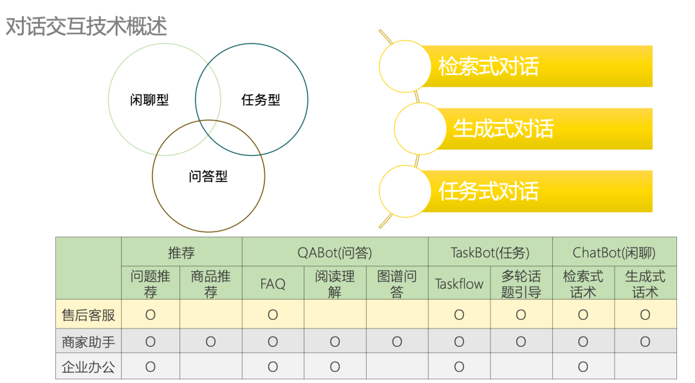

> 在技术实现上，通常又可以划分为**检索式**、**生成式**和**任务式：**

> **闲聊**、**问答**、**任务型**对话本质都是在被动地响应**用户需求**。在具体业务中还会有**`问题推荐`**、**`商品推荐`**等来主动引导用户交互。在**美团的业务场景**里主要是**任务型**和**问答型**，中间也会穿插一些闲聊，闲聊主要是打招呼或者简单情绪安抚，起到**润滑人机对话**的作用。

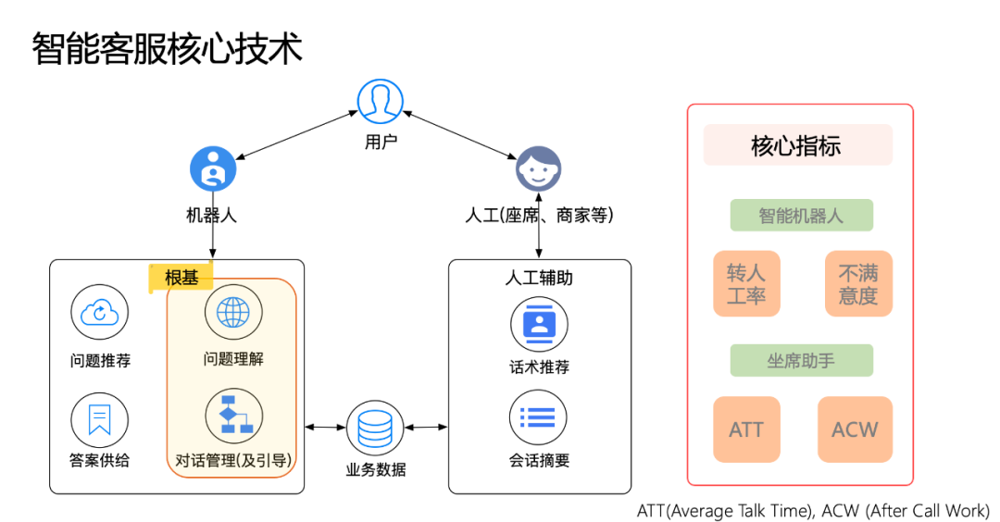

* **衡量机器人能力好坏的核心输出指标是:**

> **`不满意度`**和**`转人工率`**，分别衡量问题解决的好坏，以及能帮人工处理多少问题。而在人工辅助方面，我们提供了**话术推荐**和**会话摘要等**能力，核心指标是**`ATT`**和**`ACW`**的降低，**`ATT`**是人工和用户的平均沟通时长，**`ACW`**是人工沟通后的其它处理时长。

### 智能机器人——多轮对话

**这是一个真实的多轮对话的例子:**

> 当用户进入到服务门户后，先选择了一个推荐的问题**“如何联系骑手”**，机器人给出了联系方式致电骑手。同时为了进一步厘清场景，询问用户**`是否收到了餐品`**，当用户选择**“还没有收到”**的时候，结合预计送达时间和当前时间，发现还**`未超时`**，给出的方案是**“好的，帮用户催一下”**，或者是**“我再等等吧”**，这时候用户选择了**“我再等等吧”。**

**这个例子背后的机器人是怎么工作的呢？**

> 首先当用户输入**“如何联系骑手”**的时候，问题**理解模块**将它与**知识库**中的拓展问进行匹配，进而得到对应的标准问即意图**“如何联系骑手”**。

> 然后**`对话管理模块`**根据意图**“如何联系骑手”**触发相应的任务流程，先**查询**订单接口，**获取**骑手电话号码，进而**输出**对话状态给到答案**生成**模块，根据模板生成最终结果，如右边的红框内容所示。

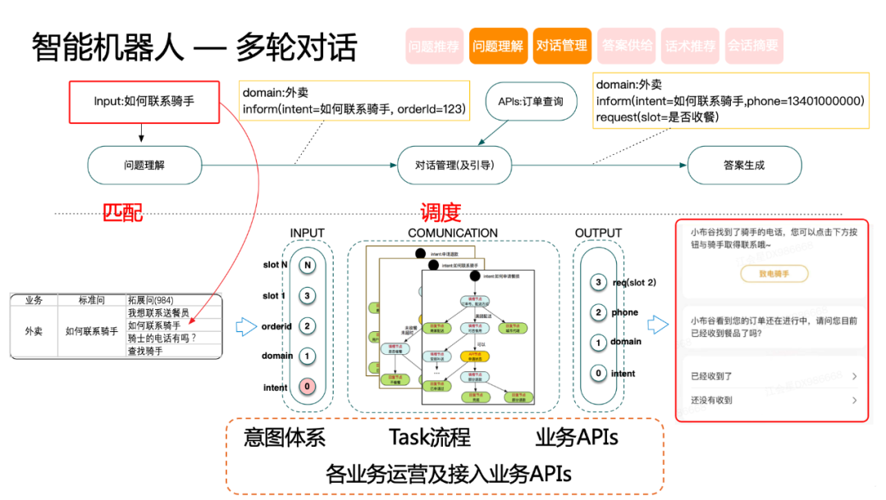

> 在这个过程中涉及到要先有意图体系、定义好**`Task`**流程，以及订单的**查询**接口，这些都是业务强相关的，主要由各业务的运营团队来维护。那么，对话系统要做的是什么呢？一是将用户的**输入**与**意图体系中的标准问进行匹配，二是完成多轮交互里面的调度。**

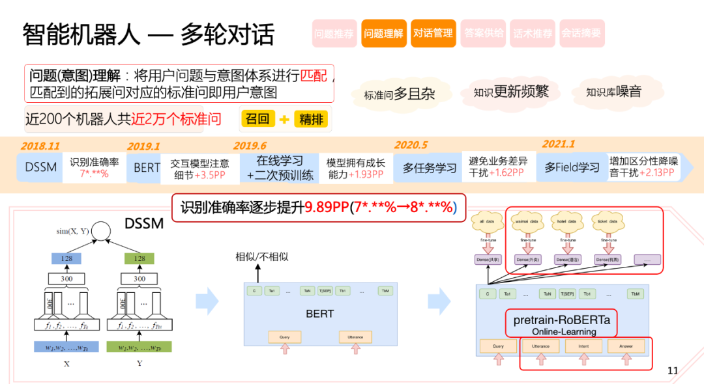

> **问题理解**是将用户问题与意图体系进行**匹配**，匹配到的拓展问所对应的标准问即用户意图。机器人的工作过程实际是要做**召回**和**精排**两件事情。**召回更多地是用现有检索引擎实现**，**技术上更多地关注精排**。

* 理解了用户意图后，有些问题是可以直接给出答案解决的，而有些问题则需要进一步厘清。

> 比如说**`“如何申请餐损”`**这个例子，不是直接告诉申请的方法，而是先厘清是哪一个**订单**，**是否**影响食用，进而厘清一些用户的诉求是部分退款还是想安排补送，**从而给出不同的解决方案。**

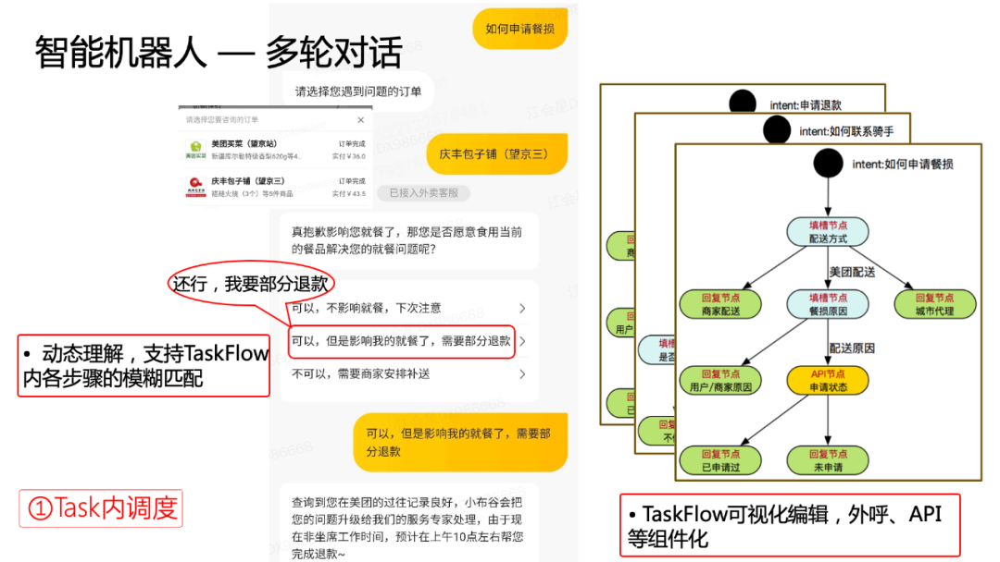

> 这样的一个流程是**跟业务强相关**的，需要由业务的运营团队来进行定义。如右边任务**流程树**所示，首先提供了可视化的**`TaskFlow`**编辑工具，并且把**外呼**、**地图**以及**API**等都组件化，然后业务运营人员可以通过拖拽的方式来完成**`Task流程设计`**。

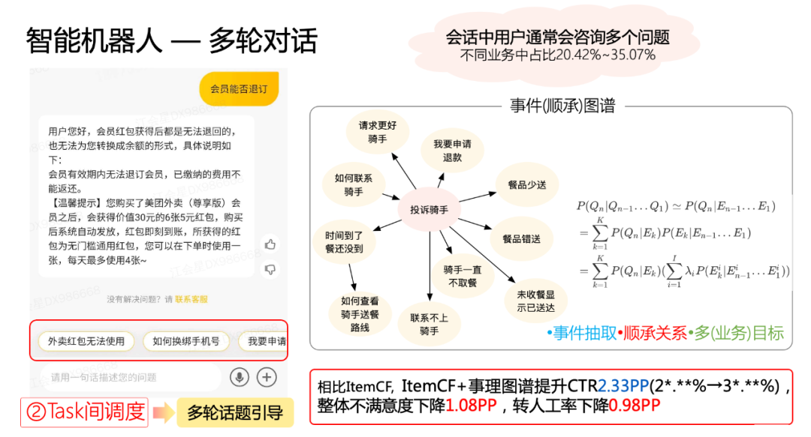

* **对话引擎**在与用户的真实交互中，要完成**`Task`**内各步骤的匹配调度。

> 比如这个例子里用户如果不是点选**`”可以但影响就餐了…”`**这条，而是自己输入说**`“还行，我要部分退款”`**，怎么办？这个意图也没有**提前定义**，这就需要对话引擎支持**`Task`**内各步骤的**模糊匹配**。基于**`Bayes Network`**搭建的**`TaskFlow Engine`**恰好能支持**规则**和**概率**的结合，这里的模糊匹配算法复用了问题理解模型的**语义匹配**能力。

**另外一个例子:**

> 1. 在用户问完**“会员能否退订”**后，机器人回复的是**“无法退回”**，虽然回答了这个问题，但这个时候用户很容易不满意，转而去寻找人工服务。
>
> 2. 如果这个时候我们除了给出答案外，还去厘清问题背后的真实原因，**引导**询问用户是“外卖红包无法使用”或者是**“因换绑手机导致的问题”**，
>
> 3. 基于**顺承关系**建模，用户大概率是这些情况，用户很有可能会选择，从而会话可以进一步进行，并给出更加**精细**的解决方案，也减少了用户直接转人工服务的**行为**。

> 这个引导任务称为**多轮话题引导**，具体做法是对会话日志中的事件共现关系以及顺承关系进行建模。如右边图所示，这里原本是要建模句子级之间的引导，考虑到句子**稀疏性**，我们是将其抽象到事件之间的引导，共现关系我们用的是经典的**协同过滤**方式建模。另外，考虑到事件之间的方向性，我们对事件之间的顺承关系进行建模，公式如下：

* 并通过多目标学习，同时考虑**点击指标**和**任务指标**，如在非转人工客服数据和非不满意数据上分别建模**`顺承关系`**，公式如下：

* 最终，在**点击率**、**不满意度**、**转人工率层面**，都取得了非常正向的收益。

> 美团平台涵盖吃、住、行、游、购、娱等200多个生活服务品类，当用户是从美团App或点评App等综合服务门户入口进入服务时，需要先行确定用户要咨询的是哪个业务，这里的一个任务是“判断用户**`Query`**是属于哪个业务”，该任务我们叫做**领域识别**。**若能明确判断领域时，则直接用该领域知识来解答；当不能明确判断时，则还需要多轮对话交互与用户进行澄清**。

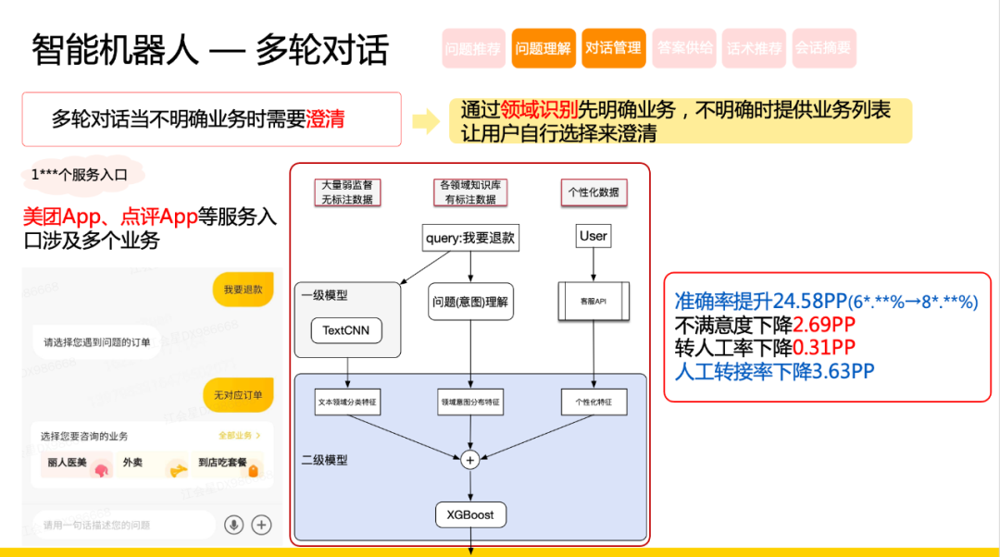

> 比如用户输入**“我要退款”**，在多个业务里都存在退款意图，这个时候就需要我们先**判断**是哪个业务的**退款意图**，如果判断**置信度不高**，则给出业务列表让用户自行选择来进行**澄清**。

> 除了美团App、点评App等综合服务入口涉及多个业务外，还有大量能够明确业务的入口，比如说订单入口，从商品详情页进来的入口，这些入口进来的对话数据是有明确业务标签信息的。因此，我们可以得到大量的**弱监督**的各业务领域的数据，基于这些数据我们可以训练一个一级**`分类模型`**。

* 同时，有些问题是需要结合用户订单状态等个性化数据才能进一步明确的。比如“我要退款”，多个业务里都会有。

* 因此，又要结合用户状态特征一起来训练一个二级模型，最终来判断用户的输入属于哪个业务。

* 最终，该二级领域识别模型在满意度、转人工率以及成功转接率指标上都取得了非常不错的收益。

### 智能机器人——问题推荐

> 在介绍完多轮对话基础模块**问题理解**和**对话管理**后，接下来我们介绍一下智能机器人的另外两个模块：**问题推荐**和**答案供给**。

> 如前面**多轮对话的例子所示**，当用户进入服务门户后，机器人首先是要如何引导用户精准地表达**需求**，这样即可**降低**用户迷失或者直接转人工服务，也**降低**了若机器人不能正确理解时带来的**多轮澄清**等无效交互。

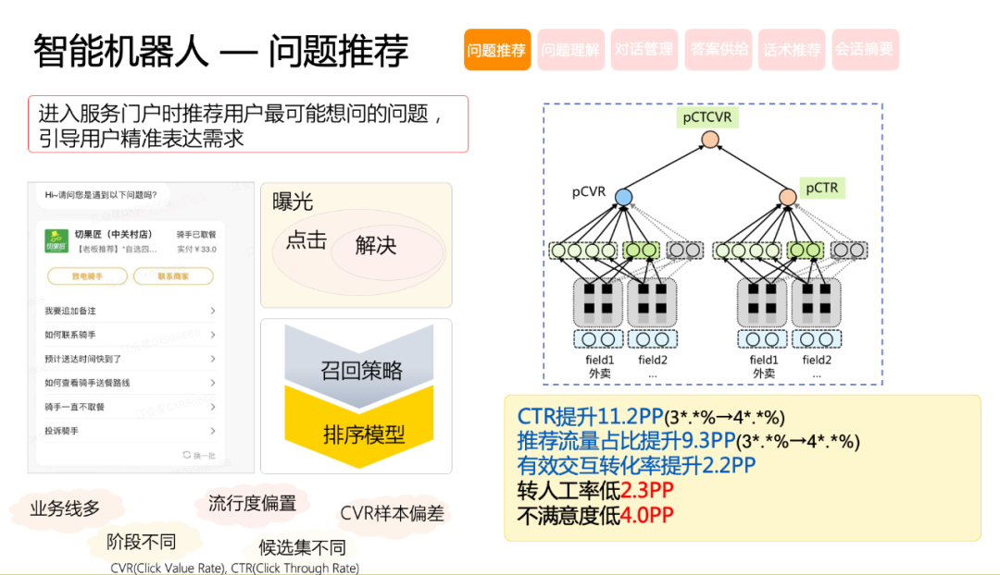

该问题是一个标准的**曝光点击**问题，它的本质是推荐问题。

> 采用了**`CTR`**预估任务经典的**`FM模型`**来作为基础模型，同时结合业务目标，期望用户点击的问题的解决方案能够**解决**用户问题，该问题最终定义为“**曝光**、**点击**、**解决**”问题，最终的模型是结合多目标学习的**`ESSM-FM`**，对有效交互的**`转化率`**、**`转人工率`**和**`不满意度`**等指标上都带来了提升。

### 智能机器人——答案供给

> * **售后场景:**通常问题较集中，且问题的解决多**依赖**业务内部系统数据及规则，通常是业务部门**维护知识库**，包括**`意图体系`**、**`Task流程`**和**`答案`**等。

> * **售前场景:**知识多来自于商户或**商品本身**、**用户体验**及**评价信息**等，具有用户问题开放、**知识密度高**、人工难以整理答案等特点。比如去哪个城市哪个景点游玩，附近有哪些酒店，酒店是否有浴缸，酒店地址在哪里等，都需要**`咨询”决策”`**，针对这些诉求，我们通过智能问答来解决**咨询**以及**答案**供给问题。

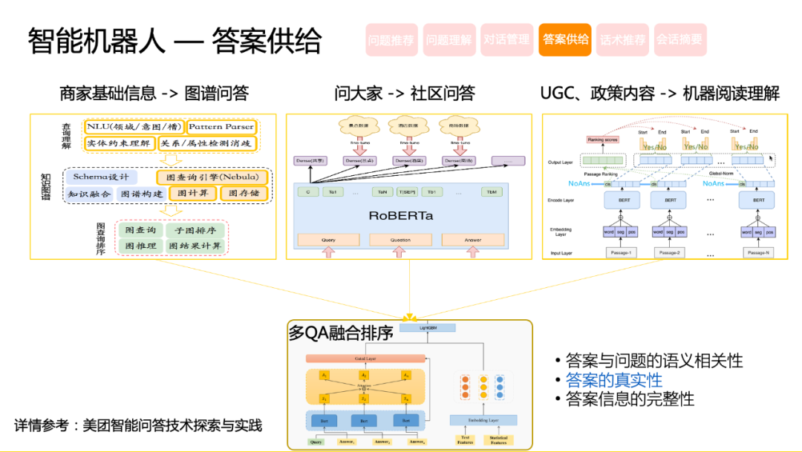

**智能问答**就是从美团数据中习得答案供给，来快速回答用户的问题，**基于不同的数据源**，所以建设了不同的问答技术。

> 1. **针对商家基础信息**，比如问营业时间、地址、价格等，我们通过图谱问答（KBQA）来解决。利用商家基础信息构建图谱，通过问题理解模型来理解问题，进而查询图谱获取准确的答案。

> 2. **针对社区数据**，即商户详情页中“问大家”模块的用户问用户答的社区数据，构建社区问答（Community QA）能力，通过对用户问题与问大家中的”问答对”的相似度建模，选择相似度最高的作为答案，来回答用户的一些开放性问题。

> 3. **针对UGC评论数据**以及商户政策等无结构化数据，构建文档问答（Document QA）能力，针对用户问题利用机器阅读理解技术从文档中抽取答案，类似我们小时候语文考试中的阅读理解题，进一步回答用户的一些开放性问题。

> 4. **针对多个问答模块给出的答案**，进行多答案来源的答案融合排序，来挑选最终的答案，此外这里还考察了答案真实性，即对“相信多数认为正确的则正确”建模。

## 人工辅助核心技术

### &#x20;人工辅助——话术推荐

在客服座席职场调研过程中发现，座席在与用户的对话聊天中经常回复相似甚至相同的话术，他们一致期望提供话术推荐的能力来提高效率。此外，除了请求客服座席帮助外，很多情况下用户与商家直接沟通会使得解决问题更高效，而沟通效率不仅影响到消费者的体验，也影响到了商家的经营。比如在外卖业务中，消费者的下单率和商家的回复时长有较为明显的反比关系，无论是客服座席还是商家，都有很强的话术推荐诉求。

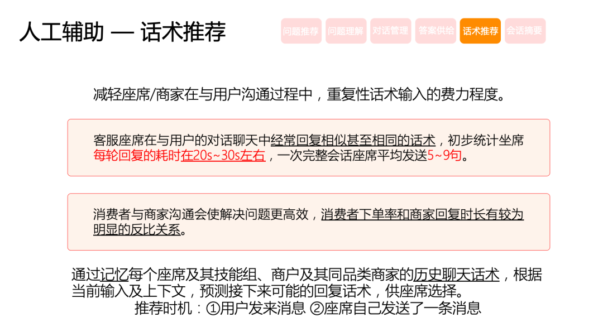

那么，话术推荐具体要怎么做呢？常见的做法是先准备好常用通用话术库，部分座席或商家也会准备个人常见话术库，然后系统根据用户的Query及上下文来检索最合适的话术来推荐。我们根据调查发现，这部分知识库维护得很不好，既有业务知识变更频繁导致已维护的知识很快不可用因素，也有座席或商家本身意愿不强的因素等。另外，针对新客服座席或者新商家，可用的经验更少。因此我们采用了自动记忆每个座席及其同技能组的历史聊天话术，商家及其同品类商家的历史聊天话术，根据当前输入及上下文，预测接下来可能的回复话术，无需人工进行整理，大大提升了效率。

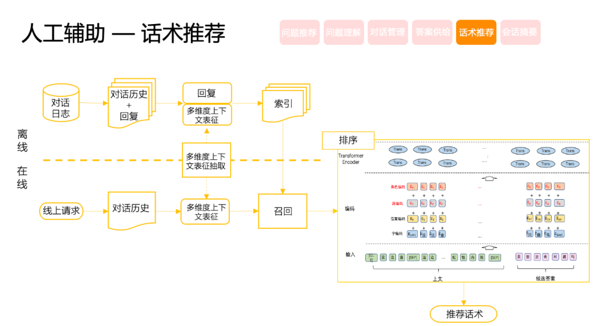

我们将历史聊天记录构建成“N+1”QA问答对的形式建模，前N句看作问题Q，后1句作为回复话术A，整个框架就可以转化成检索式的问答模型。在召回阶段，除了文本信息召回外，我们还加入了上文多轮槽位标签，Topic标签等召回优化，排序为基于BERT的模型，加入角色信息建模，角色为用户、商家或者座席。

整个架构如上图所示，分为离线和在线两部分。另外上线后我们也加入了一层CTR预估模型来提升采纳率。当前多个业务的话术推荐平均采纳率在24%左右，覆盖率在85%左右。话术推荐特别是对新座席员工价值更大，新员工通常难以组织话术，通过采纳推荐的话术可以来缩减熟练周期，观测发现，3个月内座席员工的平均采纳率是3个月以上座席员工的3倍。

### 人工辅助——会话摘要

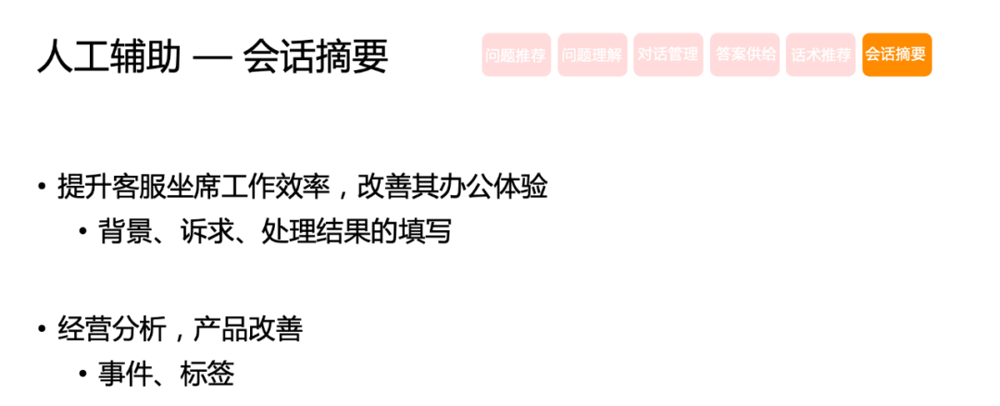

在客服场景座席跟用户沟通完后，还需要对一些必要信息进行工单纪要，包括是什么事件，事件发生的背景是什么，用户的诉求是什么，最后的处理结果是什么等等。而填写这些内容对座席来说其实是很不友好，通常需进行总结归纳，特别是有些沟通进行的时间还比较长，需要来回翻看对话历史才能正确总结。另外，为了持续对于服务产品进行改善，也需要对会话日志进行相应事件抽取及打上标签，从而方便经营分析。

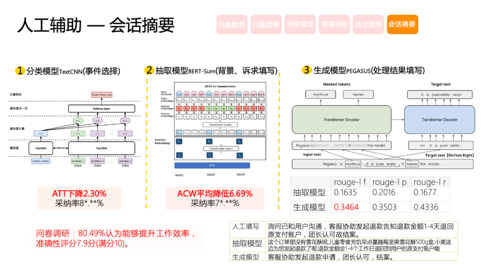

这里有些问题是选择题，有些问题是填空题，比如这通会话具体聊的是哪个事件，我们提前整理有比较完整的事件体系，可以看成是个选择题，可以用分类或者语义相似度计算模型来解决。又比如说事件发生的背景，如外卖退款的背景是因餐撒了、酒店退款的背景是到店没有房间等，是个开放性问题，分析发现可以很好地从对话内容中抽取，可以用摘要抽取模型来解决。而对于处理结果，不仅仅依赖对话内容，还包括是否外呼，外呼了是否商家接通了，后续是否需要回访等等，我们实验发现生成模型更有效。具体使用的模型如上图所示，这里事件选择考虑到经常有新事件的添加，我们转成了双塔的相似度计算任务，背景抽取采用的是BERT-Sum模型，处理结果采用的是谷歌的PEGASUS模型。

## 小结与下一步计划

### 小结——交互立方

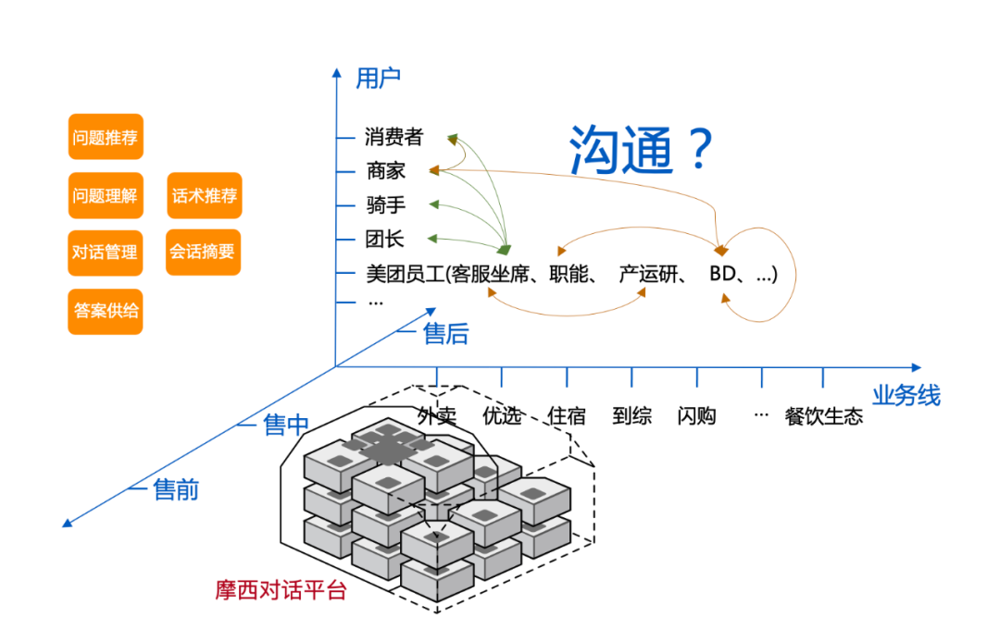

前面介绍了美团智能客服实践中的一些核心技术，过程中也穿插着介绍了客服座席与消费者/商家/骑手/团长等之间的沟通提效，以及消费者与商家之间的沟通提效。除了这两部分之外，在企业办公场景，其实还有员工之间、销售顾问与商家之间的大量沟通。如果一个个去做，成本高且效率低，解决方案是把智能客服中沉淀的能力进行平台化，最好“一揽子”进行解决，以固定成本来支持更多的业务需求。于是我们搭建了美团的对话平台-摩西对话平台，用“一揽子”方案以固定成本来解决各业务的智能客服需求。

### 小结——对话平台“摩西”

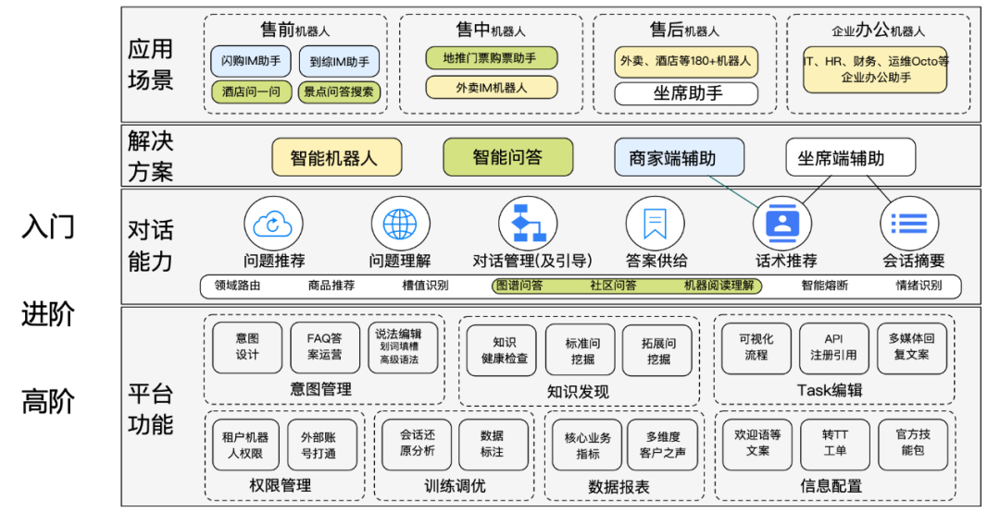

构建一个怎么样的对话平台，才能提供期望的没有NLP能力的团队也能拥有很好的对话机器人呢？首先是把对话能力工具化和流程化。如上图所示，系统可分为四层：应用场景层、解决方案层、对话能力层、平台功能层。

应用场景层：在售前应用场景，一类需求是商家助手，如图中所列的美团闪购IM助手和到综IM助手，需要辅助商家输入和机器人部分接管高频问题能力；还有一类需求是在没有商家IM的场景需要智能问答来填补咨询空缺，比如图中所列的酒店问一问和景点问答搜索；另外售中、售后以及企业办公场景，各自需求也不尽相同。

解决方案层：这就要求我们有几套解决方案，大概可以分为智能机器人、智能问答、商家辅助、座席辅助等。每个解决方案的对话能力要求也有所不同，这些解决方案是需要很方便地对基础对话能力进行组装，对使用方是透明的，可以拿来即用。

对话能力层：前面也进行了相应的介绍，六大核心能力包括问题推荐、问题理解、对话管理、答案供给、话术推荐和会话摘要。

平台功能层：此外，我们需要提供配套的运营能力，提供给业务方的运营人员来日常维护知识库、数据分析等等。

其次，提供“一揽子”的解决方案，还需要针对处在不同阶段的业务提供不同阶段的解决方案。

有些业务只希望维护好常用的问答，能回答高频的问题就好，那么他们只需要维护一个入门级的机器人，只需要在意图管理模块来维护它的意图，意图的常见说法以及答案就可以了。

而对于有运营资源的团队，他们希望不断地去丰富知识库来提升问答能力，这个时候可以使用知识发现模块，可以自动地从每天的日志里面发现新意图及意图的新说法，运营人员只需要每天花一点时间来确认添加及维护答案即可，这是一个进阶的业务方。

还有一些高级的业务方希望调用他们业务中的API来完成复杂问题的求解。这个时候他们可以使用TaskFlow编辑引擎，在平台上直接注册业务的API，通过可视化拖拽的方式来完成Task编辑。

此外， 为了进一步方便更多的业务介入，我们也提供了一些闲聊、通用指令、地区查询等官方技能包，业务方可以直接勾选使用。另外，随着我们不断在业务中沉淀，也会有越来越多的官方行业技能包。整体方向上是逐步让业务方使用的门槛变得越来越低。

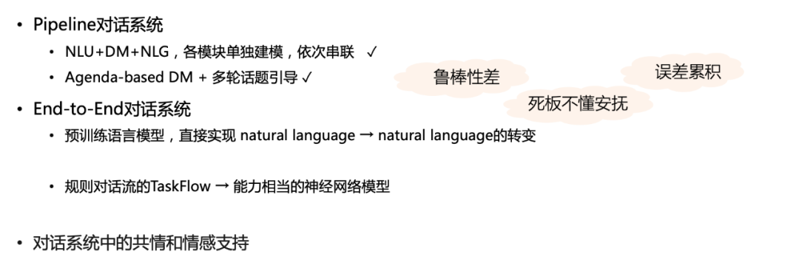

前文所介绍的对话系统是一种Pipeline式对话系统，按照功能划分为不同的模块，各个模块单独建模，依次串联。这种方式的好处是可以做到不同团队职责的有效分工，比如研发同学专注于建设好问题推荐模型、问题理解模型和Task引擎等；业务运营同学专注于意图体系维护、Task流程设计以及答案设计等等。它的劣势也很明显，模块耦合，误差累积，很难联合优化，进而各模块负责的同学可能会去修修补补，容易导致动作变形。

另一类建模方式是End-to-End，将Pipeline式对话系统的各个模块联合建模成一个模型，直接实现语言到语言的转变，此类方法最初应用在闲聊式对话系统里面，近期随着大规模预训练模型的快速发展，学术上也逐渐开始研究基于预训练模型的端到端任务型对话系统。它的优点是模型可以充分利用无监督人人会话，用数据驱动可以快速迭代；缺点是模型的可控性差，不易解释且缺乏干预能力。目前主要以学术研究为主，未见成熟的应用案例。

除了使用这种大量无监督的人人会话日志外，还有一种思路是基于Rule-Based TaskFlow构建规则的用户模拟器，进行交互以生成大量的对话数据，进而训练对话模型。为了保证对话系统的鲁棒性，也可使用类似对抗攻击的方法优化，可以模拟Hard User的行为，不按顺序执行TaskFlow，随机打断、跳转某个对话节点等等。

此外，通过对比分析人机对话日志和人人对话日志，人机对话比较僵硬死板，无法有效捕捉用户的情绪，而人就很擅长这方面。这在客服场景非常重要，用户往往进来就是带着负面情绪的，机器人需要有共情能力。而端到端数据驱动的对话和对话共情能力建设，也将是接下来一段时间我们尝试的重点方向。
